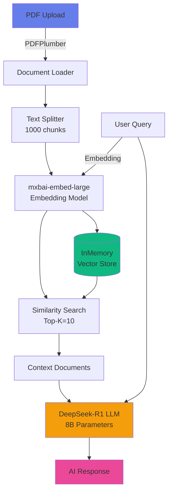

# 📚 DocuMind AI - Gelişmiş RAG Tabanlı Doküman Analiz Asistanı

<div align="center">


**DeepSeek AI ve Multilingual Embeddings ile güçlendirilmiş, yerel bilgisayarınızda çalışan akıllı doküman soru-cevap sistemi**

[🚀 Hızlı Başlangıç](#-hızlı-başlangıç) •
[✨ Özellikler](#-özellikler) •
[🏗️ Mimari](#️-mimari) •
[📖 Kullanım](#-kullanım) •
[🔧 Yapılandırma](#-yapılandırma)

</div>

---

## 🎯 Proje Hakkında

DocuMind AI, **RAG (Retrieval-Augmented Generation)** mimarisini kullanarak PDF dokümanlarınızı analiz eden ve sorularınıza doküman bazlı hassas cevaplar veren bir AI asistanıdır. Tamamen **yerel** olarak çalışır - verileriniz asla dışarıya çıkmaz.

### 🌟 Neden DocuMind AI?

- ✅ **%100 Yerel**: Verileriniz güvende, internet bağlantısı gereksiz
- 🧠 **Akıllı Semantik Arama**: Multilingual embedding ile Türkçe-İngilizce dokümanları anlar
- 🎯 **Hassas Yanıtlar**: Sadece doküman içeriğine dayalı cevaplar, hallüsinasyon yok
- ⚡ **DeepSeek R1**: En güncel ve güçlü açık kaynak LLM
- 🎨 **Modern Arayüz**: SaaS seviyesinde kullanıcı deneyimi

---

## ✨ Özellikler

### 🔍 Gelişmiş RAG Pipeline
- **PDF İşleme**: PDFPlumber ile yüksek kaliteli metin çıkarma
- **Akıllı Chunking**: Recursive Character Text Splitter (1000 token, 200 overlap)
- **Vektör Veritabanı**: InMemoryVectorStore ile hızlı similarity search
- **Multilingual Embeddings**: `mxbai-embed-large` modeli ile Türkçe desteği

### 🤖 AI Yetenekleri
| Özellik | Teknoloji | Açıklama |
|---------|-----------|----------|
| **LLM Model** | DeepSeek-R1 (8B) | Reasoning odaklı güçlü dil modeli |
| **Embedding** | mxbai-embed-large | Çok dilli semantik arama |
| **Context Window** | 10 chunk | Top-K retrieval ile optimize edilmiş |
| **Prompt Engineering** | Custom Template | Türkçe, doküman-odaklı yanıtlar |

### 🎨 Kullanıcı Arayüzü
- 🌙 **Dark Mode**: Göz yormayan gradient tema
- 💬 **Chat Interface**: Gerçek zamanlı sohbet deneyimi
- 📊 **Retrieval Stats**: Şeffaf arama sonuçları
- 🗑️ **Session Management**: Sohbet geçmişi ve veritabanı kontrolü
- 📱 **Responsive**: Sidebar ile optimize edilmiş layout

---

## 🏗️ Mimari

### Sistem Diagramı



### 🔄 RAG Pipeline Akışı

1. **Doküman İşleme**
   ```
   PDF → PDFPlumber → Raw Text → RecursiveCharacterTextSplitter → Chunks
   ```

2. **Vektörizasyon**
   ```
   Chunks → mxbai-embed-large → Vector Embeddings → InMemoryVectorStore
   ```

3. **Query İşleme**
   ```
   User Question → Embedding → Similarity Search → Top-10 Chunks
   ```

4. **Cevap Üretimi**
   ```
   Question + Context → Prompt Template → DeepSeek-R1 → Answer
   ```

### 🧩 Teknoloji Stack

| Katman | Teknoloji | Versiyon |
|--------|-----------|----------|
| **Frontend** | Streamlit | 1.31+ |
| **LLM Framework** | LangChain | 0.1+ |
| **LLM Engine** | Ollama | Latest |
| **Models** | DeepSeek-R1, mxbai-embed | 8B, 669MB |
| **Python** | 3.10+ | - |

---

## 🚀 Hızlı Başlangıç

### 📋 Gereksinimler

- **Python**: 3.10 veya üzeri
- **Ollama**: Yerel LLM çalıştırıcı
- **RAM**: Minimum 8GB (16GB önerilir)
- **Disk**: ~6GB boş alan (modeller için)

### 🔧 Kurulum

#### 1️⃣ Ollama Kurulumu

**Windows:**
```powershell
# Ollama'yı indirin ve kurun
winget install Ollama.Ollama
```

**Linux/macOS:**
```bash
curl -fsSL https://ollama.com/install.sh | sh
```

#### 2️⃣ Modelleri İndirin

```bash
# DeepSeek R1 (LLM)
ollama pull deepseek-r1:8b

# Multilingual Embedding
ollama pull mxbai-embed-large
```

#### 3️⃣ Projeyi Klonlayın

```bash
git clone https://github.com/MustafaKocamann/Rag-Agent-with-Deepsek.git
cd Rag-Agent-with-Deepsek
```

#### 4️⃣ Sanal Ortam Oluşturun

```bash
# Windows
python -m venv venv
venv\Scripts\activate

# Linux/macOS
python3 -m venv venv
source venv/bin/activate
```

#### 5️⃣ Bağımlılıkları Yükleyin

```bash
pip install -r requirements.txt
```

#### 6️⃣ Uygulamayı Başlatın

```bash
streamlit run rag_deepsek.py
```

🎉 **Tarayıcınızda otomatik açılacaktır:** `http://localhost:8501`

---

## 📖 Kullanım

### 1. PDF Yükleme
1. Sol sidebar'daki **"PDF Yükle"** alanına dokümanınızı sürükleyin
2. Otomatik işleme başlar (chunking + embedding)
3. ✅ Başarı mesajı görünce hazır!

### 2. Soru Sorma
```
Kullanıcı: "Bu doküman ne hakkında?"
AI: "Makine öğrenmesi, bilgisayarlara verilerden öğrenme yeteneği kazandıran..."
```

### 3. Retrieval Stats İnceleme
- Expander'a tıklayarak hangi chunks'ın kullanıldığını görebilirsiniz
- Top-10 sonucun preview'ını inceleyin

### 4. Session Yönetimi
- **🗑️ Sohbeti Temizle**: Sadece chat history'yi siler
- **🔄 Veritabanını Sıfırla**: Tüm doküman verisini temizler

---

## 🔧 Yapılandırma

### Model Değiştirme

`rag_deepsek.py` dosyasında:

```python
# LLM Modeli
LLM_MODEL_NAME = "deepseek-r1:8b"  # Alternatif: "llama2", "mistral"

# Embedding Modeli
EMBEDDING_MODEL_NAME = "mxbai-embed-large"  # Alternatif: "nomic-embed-text"
```

### Chunk Parametreleri

```python
text_splitter = RecursiveCharacterTextSplitter(
    chunk_size=1000,      # Daha büyük parçalar için artırın
    chunk_overlap=200,    # Bağlam korunumu için overlap
    add_start_index=True
)
```

### Top-K Ayarı

```python
related_docs = find_related_documents(prompt, k=10)  # k=15 veya k=20 deneyin
```

---

## 🎨 Ekran Görüntüleri

### Ana Arayüz
```
📚 DocuMind AI
🚀 Gelişmiş Doküman Analiz Asistanı

[Sidebar]              [Chat Area]
📂 Dosya Merkezi       💬 Sohbet
└─ PDF Yükle          └─ User: Makine öğrenmesi nedir?
└─ 🗑️ Temizle          └─ AI: [Doküman bazlı cevap]
└─ 🔄 Sıfırla          └─ 📊 Retrieval Stats
```

---

## 🚢 Deployment (Yerel Sınırlama)

### ⚠️ Streamlit Cloud'a Deploy Edilemez

Bu proje **Ollama** kullandığı için Streamlit Cloud'a deploy edilemez çünkü:
- ❌ Ollama yerel makine gerektir
- ❌ Streamlit Cloud sanal sunucularda çalışır
- ❌ Modelleri cloud'a yükleyemezsiniz

### ✅ Alternatif Deployment Seçenekleri

#### 1. Docker ile Yerel Sunucu
```dockerfile
FROM python:3.10-slim

# Ollama kurulumu
RUN curl -fsSL https://ollama.com/install.sh | sh

# Proje kurulumu
COPY . /app
WORKDIR /app
RUN pip install -r requirements.txt

# Modelleri indir
RUN ollama pull deepseek-r1:8b
RUN ollama pull mxbai-embed-large

CMD ["streamlit", "run", "rag_deepsek.py"]
```

#### 2. Modal/Replicate Gibi GPU Platformları
- Ollama'yı API modunda çalıştırın
- Streamlit'i ayrı deploy edin
- API çağrıları ile bağlayın

#### 3. VPS/Dedicated Server
- DigitalOcean, Linode, AWS EC2
- GPU destekli instance seçin
- Ollama + Streamlit kurun
- Reverse proxy (Nginx) ile yayınlayın

---

## 🛠️ Teknik Detaylar

### Session State Yönetimi
```python
# Kritik: Vector DB her re-run'da sıfırlanmasın
if "vector_db" not in st.session_state:
    embeddings = OllamaEmbeddings(model=EMBEDDING_MODEL_NAME)
    st.session_state.vector_db = InMemoryVectorStore(embeddings)
```

**Neden Önemli?**
- Streamlit her etkileşimde kodu baştan çalıştırır
- Session state olmadan DB sıfırlanır, veriler kaybolur
- Bu mimari sayede veriler oturumda kalıcı olur

### Prompt Engineering
```python
PROMPT_TEMPLATE = """
Sen, yalnızca sağlanan dokümanlara dayanarak yanıt veren titiz bir araştırma asistanısın. 
Yanıtlarını oluştururken doküman dışına çıkma; eğer aranan bilgi bağlam içerisinde mevcut değilse, 
dış bilgini kullanmak yerine 'Bu bilgi sağlanan dökümanlarda bulunmamaktadır' şeklinde belirt. 
Cevaplarını olabildiğince öz, teknik doğruluğu yüksek ve maksimum 3 cümle olacak şekilde yapılandır.
"""
```

**Best Practices:**
- ✅ Doküman dışına çıkma engeli
- ✅ Türkçe native support
- ✅ Kısa ve öz yanıtlar (3 cümle)
- ✅ Teknik doğruluk vurgusu

---

## 📊 Performans

### Model Boyutları
- **DeepSeek-R1 8B**: ~5.2 GB
- **mxbai-embed-large**: ~669 MB
- **Toplam**: ~6 GB

### İşlem Süreleri (Ortalama)
| İşlem | Süre |
|-------|------|
| PDF Upload + Chunking | 2-5 saniye |
| Embedding + Indexing | 5-10 saniye |
| Query + Response | 3-8 saniye |

### RAM Kullanımı
- **İlk Başlatma**: ~4 GB
- **Model Yüklü**: ~6-8 GB
- **Query Sırasında**: ~7-9 GB

---

## 🤝 Katkıda Bulunma

Katkılarınızı bekliyoruz! İşte nasıl:

1. Fork'layın
2. Feature branch oluşturun (`git checkout -b feature/amazing-feature`)
3. Commit'leyin (`git commit -m 'feat: Add amazing feature'`)
4. Push'layın (`git push origin feature/amazing-feature`)
5. Pull Request açın

### 🐛 Bug Bildirimi
[Issues](https://github.com/MustafaKocamann/Rag-Agent-with-Deepsek/issues) sayfasından bildirebilirsiniz.

---

## 📝 Lisans

Bu proje MIT lisansı altında lisanslanmıştır. Detaylar için [LICENSE](LICENSE) dosyasına bakın.

---

## 👨‍💻 Geliştirici

**Mustafa Kocaman**

- GitHub: [@MustafaKocamann](https://github.com/MustafaKocamann)
- LinkedIn: [Profiliniz]

---

## 🙏 Teşekkürler

- [Streamlit](https://streamlit.io/) - Harika framework
- [LangChain](https://www.langchain.com/) - RAG pipeline
- [Ollama](https://ollama.com/) - Yerel LLM desteği
- [DeepSeek](https://www.deepseek.com/) - Güçlü AI modeli

---

<div align="center">

**⭐ Projeyi beğendiyseniz yıldız vermeyi unutmayın!**

Made with ❤️ and 🤖 AI

</div>
